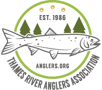

# Final Integrated Project

### Team Members: Jimmy Calderon - Tien Le

## Thames River Anglers Association Website

[Thames River Anglers Association](https://www.anglers.org "TRAA Website")

## The Project

### For this project we designed and developed a fully responsive website using HTML, CSS, JavaScript and the Greensock library to create an engaging user experience with animations and captivating visuals. We created a one-page website with seven sections including a custom-made image gallery for the merchandising section made with JavaScript.

### Moreover, for this project we designed and produced an informational video using Adobe Illustrator and Adobe After Effects. 

#### Sections:
 * HOME
 * ABOUT
 * EVENTS
 * PROJECTS 
 * NEWSLETTER 
 * GEAR 
 * CONTACT

## Instructions

* Download the file
* Unzip the file
* Open index.htlm on your favourite browser
* Make sure you have JavaScript enable on your browser.